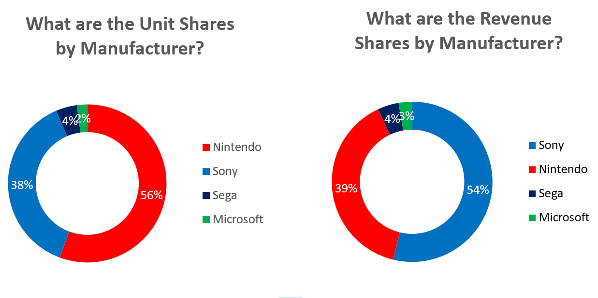

## Project Overview

**Important:** All insights shown are based on the default slicers (`SalesBasisType = Lifetime`, `ActiveFlag = Ended`, `IsHardwareEstimate = 0`) unless stated otherwise.

This project analyzes the video game console hardware market from the perspective of a market intelligence firm. The goal is to support **investment and market-sizing decisions** by quantifying hardware scale (units sold), estimated hardware revenue (proxy), and best-seller software pull-through (attach rate). Deliverables include an interactive Excel dashboard, a 1-page executive summary, a longer 4-page executive brief, and supporting visuals (screenshots + a dashboard demo GIF).

📄 Executive Summary (1-page PDF): [Console Market Intelligence Executive Summary](Console_Market_Intelligence_Executive_Summary_1page.pdf)

## Skills demonstrated

- **Dashboard design (Excel):** Built an interactive dashboard with slicers, KPI cards, and segmented views to support stakeholder decision-making.
- **Market sizing and segmentation:** Analyzed console performance by manufacturer, generation, and lifecycle status to quantify reach and revenue concentration.
- **Metric design and interpretation:** Defined and applied proxy metrics (estimated hardware revenue, average hardware price) and behavioral indicators (best-seller attach rate) with clear caveats.
- **Executive communication:** Translated analysis into an executive summary format (1-page and extended brief) with evidence-backed insights and stakeholder takeaways.
- **Data quality mindset:** Performed basic QA checks (duplicates, formula validation, realistic ranges, and filter-consistency) to ensure outputs are reliable under the defined scope.

## Business Questions

1. What is the total size of the console hardware market in this dataset under the current dashboard filters (units sold and estimated hardware revenue)?

2. Which consoles have the largest installed base (top consoles by units sold)?

3. Which consoles generate the most estimated hardware revenue (proxy)?

4. How do manufacturer unit share and revenue share compare, and what does that imply about monetization (value vs volume)?

5. Which consoles show the strongest best-seller software pull-through (best-seller attach rate)?

### Insight 1: Market baseline (filtered view)

**Headline:** Under the current dashboard filters, the console hardware market totals **~1.1B units** and **~$265.1B** in **estimated hardware revenue (proxy)**.

**What it means:** This establishes the **historical market scale** within the selected scope (3rd–8th generation consoles in the current filtered view), creating a consistent baseline for comparing consoles, manufacturers, and generations.

**Stakeholder takeaway:** Use this baseline as the reference point for **market sizing and investment comparisons** across segments (for example: installed base vs revenue capture vs software pull-through).

**Evidence:**  

### Insight 2: Reach and dominance (units sold)

**Headline:** The top three consoles by lifetime units sold (**PlayStation 2, Nintendo DS, and Game Boy**) account for **~40% of all units** in the current filtered view (combined **~435M units**).

**What it means:** Installed base is **highly concentrated**, with a small number of platforms capturing a disproportionate share of total hardware adoption. The **PlayStation 2 leads at 160M units**, with the Nintendo DS close behind at 156M.

**Stakeholder takeaway:** Use these rankings to prioritize market-sizing and platform focus around ecosystems with historically proven reach, while validating platform choices using the relevant filter view (Lifetime vs As-Of, generations included).

**Evidence:**  

### Insight 3: Revenue concentration (estimated hardware revenue, proxy)

**Headline:** In the current filtered view, **Sony’s PlayStation 1, PlayStation 2, and PlayStation 3** account for **~$122B (~46%)** of total **estimated hardware revenue (proxy)**.

**What it means:** Estimated hardware revenue is **highly concentrated** in a small set of platforms. Sony’s presence across multiple generations indicates sustained ability to capture a large share of hardware dollars over time (within this dataset’s scope and assumptions).

**Stakeholder takeaway:** This supports prioritizing investment analysis and market-sizing focus on ecosystems with historically strong revenue capture, while validating conclusions against the relevant filter view (Lifetime vs As-Of, generations included).

**Evidence:**  

### Insight 4: Volume vs value (manufacturer unit share vs revenue share)

**Headline:** In the current filtered view, **Nintendo leads unit share (56%)**, while **Sony leads estimated hardware revenue share (54%)**.

**What it means:** The shares suggest a strategic split between **reach vs monetization**.  
**Sony over-indexes on revenue** (38% of units vs 54% of revenue), while **Nintendo over-indexes on volume** (56% of units vs 39% of revenue), implying a higher average price per unit for Sony’s hardware mix in this view.

**Stakeholder takeaway:** Use this split to guide investment and market-sizing analysis depending on the goal: prioritize **Nintendo for reach/scale** and **Sony for revenue concentration**, then validate conclusions under alternate filter views (Lifetime vs As-Of, different generations).

**Evidence:**  

### Insight 5: Software pull-through (best-seller attach rate)

**Headline:** Nintendo platforms show the strongest best-seller software pull-through, led by the **Wii (81.6%)**, followed by **NES (65.0%)** and **Wii U (62.4%)**.

**What it means:** These attach rates (best-selling game units ÷ hardware units) indicate that a single “system-seller” title can reach a very large share of the installed base on certain platforms, signaling strong software pull-through and high blockbuster penetration among console owners.

**Stakeholder takeaway:** Use high attach-rate platforms to inform **bundle strategy and marketing allocation**, especially when evaluating how much a flagship title can expand adoption and drive engagement within an ecosystem.

**Evidence:**  

## Recommendations (directional)

> Note: This project uses a filtered, lifetime view and includes estimated revenue proxies. Use these recommendations as directional guidance and validate with current-generation / As-Of data before making forward-looking decisions.

1) **Use the market baseline for consistent sizing comparisons.**  
Treat the filtered market totals as a reference point when comparing consoles, manufacturers, and generations across the dashboard.

2) **Prioritize ecosystems differently based on the goal (reach vs dollars).**  
Use unit share to guide reach-oriented sizing (audience scale) and revenue share to guide value-oriented sizing (hardware dollar concentration), rather than treating all platforms as equivalent.

3) **Focus deeper analysis where revenue is concentrated.**  
Where a small number of platforms capture a large share of estimated hardware revenue, prioritize deeper sizing and investment evaluation on those ecosystems first.

4) **Apply volume vs value signals to manufacturer-level strategy.**  
Use the unit-share vs revenue-share split to frame manufacturer positioning: volume ecosystems emphasize scale, while value ecosystems emphasize monetization per unit.

5) **Use best-seller attach-rate signals to inform bundling and launch strategy.**  
On platforms with high best-seller attach rates, treat flagship titles as system-sellers and prioritize bundle and launch planning around expected software pull-through.

## Dashboard Demo

https://github.com/user-attachments/assets/d6397795-ec64-4275-a2ca-1c2aabe65dfe

## How to use the dashboard

1) **Open the workbook and go to the `Dashboard` tab.**  
This tab contains the KPIs, charts, and slicers used for the findings in this project.

2) **Default view (recommended starting point)**  
The dashboard is designed to load with a consistent baseline view:
- `SalesBasisType` = **Lifetime**
- `ActiveFlag` = **Ended**
- `IsHardwareEstimate` = **0**

3) **Use slicers to change the scope of analysis**
- `SalesBasisType`:  
  - **Lifetime** shows total lifecycle performance.  
  - **AsOf** uses the selected `AsOfDate` snapshot.
- `AsOfDate`: Select a point-in-time date when using **AsOf**.
- `Manufacturer`: Filter results to specific manufacturers.
- `Generation`: Filter to one or multiple console generations.
- `ActiveFlag`: Toggle between **Active** and **Ended** consoles.
- `IsHardwareEstimate`:  
  - **0** uses non-estimated (reported) hardware unit values when available.  
  - **1** includes estimated values where applicable (useful for broader coverage, but less certain).

4) **Read the KPIs first (top row)**  
These update based on slicers and summarize the current view:
- **Total Hardware Units Sold**
- **Estimated Hardware Revenue (Global, proxy)**
- **Average Hardware Price**

5) **Then use the charts to answer the business questions**
- Top consoles by units sold (reach / installed base)
- Top consoles by estimated revenue (value concentration)
- Unit share vs revenue share by manufacturer (volume vs value strategy)
- Best-seller attach rate (best-selling game units ÷ hardware units)

6) **Interpretation notes**
- Estimated hardware revenue is a **proxy** intended for comparison, not audited manufacturer financial reporting.
- Rankings and shares are **filter-sensitive**, so conclusions should be read within the active slicer context.

## Scope and default filters

**Scope:** This dataset covers global console hardware performance across manufacturers and generations. In this project, **Lifetime** refers to the total units sold and estimated revenue captured over a console’s full commercial lifecycle (for consoles that have **ended production**).

**Default slicer view (used for all insights unless stated otherwise):**
- `SalesBasisType` = **Lifetime**
- `ActiveFlag` = **Ended**
- `IsHardwareEstimate` = **0**
- `Manufacturer` = **All selected**
- `Generation` = **3rd Gen through 8th Gen**

**Interpretation:** `IsHardwareEstimate = 0` limits the view to **non-estimated hardware unit values where available** (higher confidence than estimated values).

**Data transparency:** This project uses a **synthetic dataset generated with ChatGPT**, and hardware revenue is represented using **proxy estimates** for comparative analysis.

## Metric definitions (mini glossary)

- **Total Hardware Units Sold:** Sum of **HardwareUnitsSold (Global)** across all consoles included in the current slicer view.

- **Estimated Hardware Revenue (Global, proxy):** Calculated as **HardwareUnitsSold (Global) × HardwareASP_USD**, then summed across consoles in the current slicer view.  
  *Note: This is a proxy estimate generated from assumed ASP values (synthetic), used for comparison rather than audited financial reporting.*

- **Average Hardware Price:** Weighted average price calculated as  
  **Estimated Hardware Revenue (proxy) ÷ Total Hardware Units Sold**.

- **Best-seller attach rate:** Best-selling game penetration per console, calculated as  
  **BestSellingUnitsSold ÷ HardwareUnitsSold (Global)** (reported as a percentage).  
  *This reflects best-seller penetration, not total software attach across the full game catalog.*

## Data dictionary (key fields)

| Field | Type | Description |
|------|------|-------------|
| `ConsoleName` | Categorical | Name of the console platform (e.g., PlayStation 2, Wii). |
| `Manufacturer` | Categorical | Console manufacturer (e.g., Sony, Nintendo, Microsoft). |
| `Generation` | Categorical | Console generation grouping used for segmentation (e.g., 3rd–8th gen). |
| `GameReleaseDate` | Date | Release date of the best-selling game associated with the console (where available). |
| `BestSellingGameTitle` | Text | Best-selling game title for the console (used in attach-rate context). |
| `HardwareUnitsSold (Global)` | Numeric | Global lifetime hardware units sold for the console under the selected `SalesBasisType`. |
| `HardwareASP_USD` | Numeric (Proxy) | Average selling price (USD) used to estimate revenue (synthetic / assumed). |
| `Estimated Hardware Revenue (Proxy) (Global USD)` | Numeric (Derived) | Proxy estimate calculated as `HardwareUnitsSold (Global) × HardwareASP_USD`. |
| `Launch Year` | Numeric | Console launch year (used for lifecycle context). |
| `EndOfLifeYear` | Numeric | Console end-of-life year (used to classify ended/active lifecycle). |
| `SalesBasisType` | Categorical | Defines whether values represent `Lifetime` totals or an `As-Of` snapshot view. |
| `ActiveFlag` | Categorical | Lifecycle status indicator used for filtering (e.g., `Active` vs `Ended`). |
| `IsHardwareEstimate` | Binary | Flag indicating whether hardware units are estimated (`1`) or non-estimated (`0`) where available. |
| `AsOfDate` | Date | Snapshot date used when `SalesBasisType = AsOf`. |

## Methodology and QA checks

**Method overview**
- Built a market-sizing and segmentation view using console-level fields (manufacturer, generation, lifecycle status) and dashboard slicers to support comparative analysis.
- Estimated hardware revenue using a proxy method: `HardwareUnitsSold (Global) × HardwareASP_USD`.

**QA checks performed**
- **Duplicate check:** Reviewed potential duplicates by `ConsoleName` (and validated console naming consistency where applicable).
- **Revenue validation:** Verified `Estimated Hardware Revenue (Proxy)` equals `HardwareUnitsSold (Global) × HardwareASP_USD`.
- **Dashboard consistency:** Confirmed dashboard slicer defaults match the views used in the executive summary outputs.
- **Format and types:** Checked that critical numeric/date fields are consistently formatted (units, USD, years, dates).
- **Completeness:** Ensured key analysis fields are populated (console name, manufacturer, generation, units, ASP/proxy inputs).
- **Attach-rate sanity:** Quick-checked that best-seller attach rates stay within a realistic range (0%–100%) with no outliers above 100%.
- **Range checks:** Confirmed there are no negative values in units sold, ASP, or estimated revenue proxy fields.

## Limitations and next steps

**Limitations**
- **Revenue is proxy-based:** Estimated hardware revenue is calculated using assumed ASP values and should be treated as directional for comparisons, not audited financial reporting.
- **Synthetic dataset:** This dataset was generated with ChatGPT for portfolio purposes and does not represent an official source of record.
- **Attach rate scope:** The attach-rate metric reflects **best-seller penetration** (best-selling game units ÷ hardware units), not total software attach across the full catalog.
- **Filter sensitivity:** Rankings and shares can change materially when slicers change (Lifetime vs As-Of, generation selection, lifecycle status, estimate flags).

**Next steps (if expanding this analysis)**
- Validate proxy ASP assumptions using public pricing history or audited sources and add confidence ranges where possible.
- Add catalog-level software sales to compute full attach rate (not best-seller only) and segment by time period and region.
- Extend the dataset to include current-generation consoles and recent As-Of snapshots to support forward-looking market sizing.

## Repo contents

- `README.md`  
  Project overview, business questions, key insights with evidence, and methodology notes.

- `Console_Market_Intelligence_Executive_Summary_1page.pdf`  
  One-page executive summary (high-level findings + visuals).

- `Console Market Intelligence Dashboard Executive Summary.pdf`  
  Longer executive brief (expanded narrative and supporting detail).

- `Screenshots/`  
  Dashboard evidence used in the README and executive summaries:
  - `Insight1_KPI_Filter.png` (Insight 1)
  - `Insight2_Top_Units_Sold.png` (Insight 2)
  - `Insight3_Top_Revenue.png` (Insight 3)
  - `Insight4_Unit_and_Revenue_Shares.png` (Insight 4)
  - `Insight5_Top_Best_Seller_Attach_Rate.png` (Insight 5)
