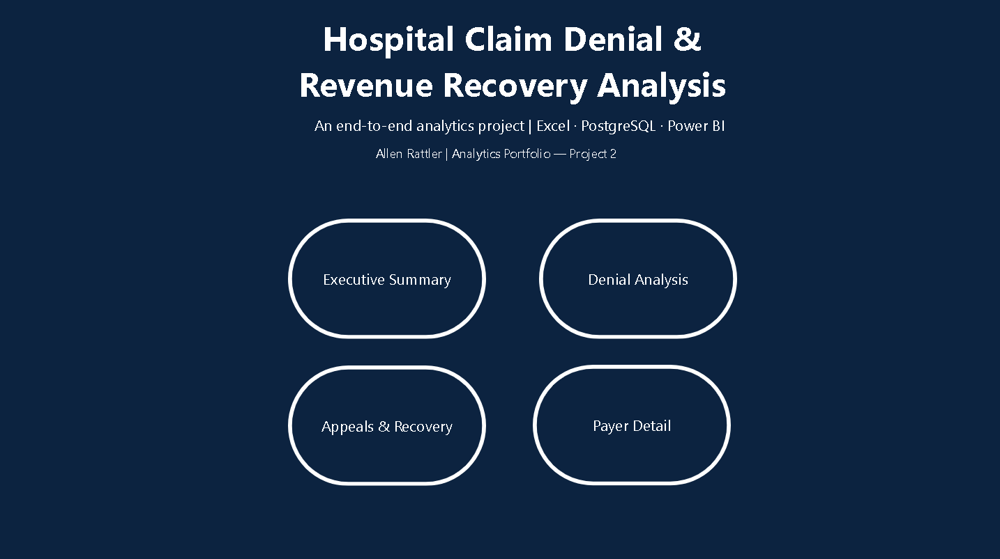
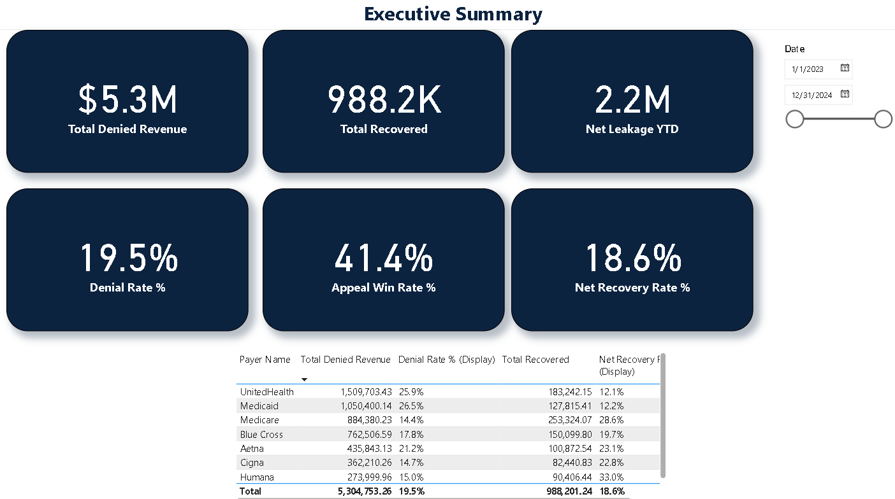
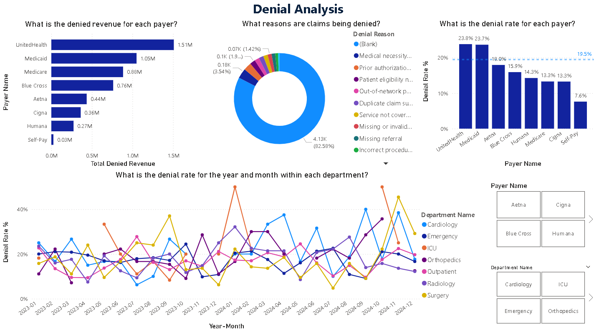
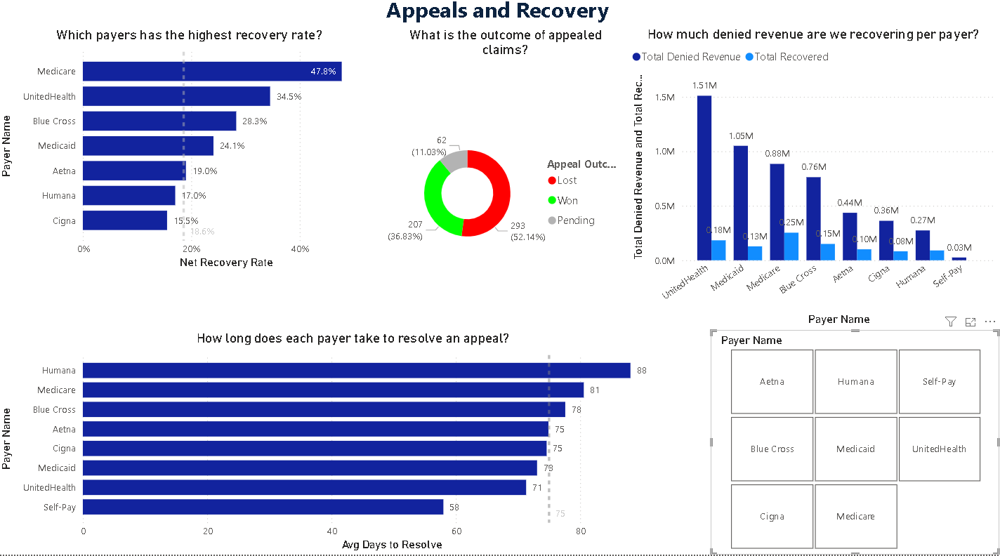
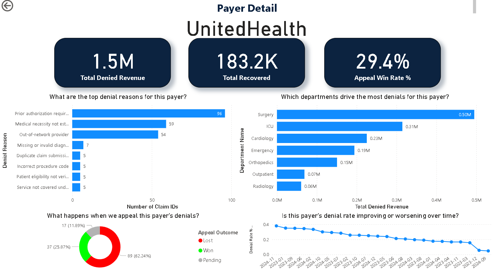

# Hospital Claim Denial & Revenue Recovery Analysis

**Allen Rattler | Analytics Portfolio — Project 2**

---

## Project Overview

**Synthetic Data Disclaimer:** All payer names, claims, financial figures, denial rates, recovery rates, procedure codes, findings, and recommendations in this project are based on synthetic data created solely for educational and portfolio purposes. They do not represent actual performance by any insurer, healthcare organization, patient, or other entity.

Hospitals lose billions of dollars every year to insurance claim denials. Most of that loss is invisible — buried in disconnected spreadsheets, siloed across departments, and discovered only after the window to appeal has closed.

This project builds an end-to-end analytical pipeline that surfaces the full shape of that problem: which payers are denying the most revenue, which internal departments are contributing to it, whether the appeals process is working, what the total financial damage looks like month over month, and — most importantly — which claims are most likely to be denied before they are ever submitted.

The goal is to give a Revenue Cycle Management (RCM) team the analytical tools to move from reactive damage control to proactive denial prevention.

**This is Project 2 of my analytics portfolio.** In Project 1 (Education Analytics Dashboard), I built a student performance gap analysis using PostgreSQL and Power BI. This project preserves that same end-to-end structure while deliberately evolving two areas: a Power BI drill-through page for payer-level deep dives, and a more complex SQL architecture using four-CTE queries, composite risk scoring, and YTD running totals. Each project in this portfolio is designed to demonstrate progressive technical growth across a range of industries.

---

## The Business Problem

> *"Which insurance payers, hospital departments, and procedure codes are generating the most claim denials — and how much net revenue is being lost before anyone notices?"*

This question was chosen because it represents one of the highest-value analytical problems in healthcare finance. The American Hospital Association estimates that U.S. hospitals spend over $19 billion annually managing insurance denials. For most hospitals, the data to understand and reduce that cost already exists — it just hasn't been connected end to end.

This project connects it.

---

## Analytical Sub-Questions

The project is structured around five analytical questions that build on each other as a coherent argument:

| # | Question | Business Value |
|---|---|---|
| Q1 | Which payers have the highest denial rates and denied revenue? | Prioritize payer contract negotiations |
| Q2 | Which departments have worsening denial trends month-over-month? | Target internal process improvement |
| Q3 | When denied claims are appealed, which payers are worth fighting? | Focus appeals staff effort where it pays off |
| Q4 | How much net revenue is permanently lost each month and YTD? | Quantify financial damage for executive reporting |
| Q5 | Which CPT/ICD-10 code combinations carry the highest denial risk? | Flag high-risk claims before submission |

---

## Project Structure

```
Hospital-Claim-Denial-Revenue-Recovery/
├── data/
│   ├── raw/                          # Python-generated synthetic CSV files
│   │   ├── claims_raw.csv
│   │   ├── appeals_raw.csv
│   │   ├── payers_lookup.csv
│   │   └── departments_lookup.csv
│   └── processed/                    # Excel/Power Query cleaned output
│       ├── claims_clean.csv
│       ├── appeals_clean.csv
│       ├── payers_lookup.csv
│       └── departments_lookup.csv
├── sql/
│   ├── 00_setup.sql                  # Table creation and data import
│   ├── 01_denial_rate_by_payer.sql
│   ├── 02_department_denial_trends.sql
│   ├── 03_appeals_recovery_rate.sql
│   ├── 04_revenue_leakage_mom.sql
│   └── 05_high_risk_procedure_codes.sql
├── powerbi/
│   └── Hospital-Claim-Denial-Revenue-Recovery-Dashboard.pbix
├── docs/
│   ├── data_cleaning.xlsx            # Power Query workbook with all Applied Steps
│   └── screenshots/                  # Dashboard page screenshots
└── README.md
```

---

## Tools & Technologies

| Tool | Purpose |
|---|---|
| AI-Assisted Data Generation | Claude-generated Python/Faker workflow used to create the synthetic dataset. |
| Excel / Power Query | Data cleaning, profiling, and calendar table |
| PostgreSQL (pgAdmin) | SQL analysis and transformation |
| Power BI Desktop | Dashboard, DAX measures, drill-through |
| GitHub | Version control and portfolio hosting |

---

## Data Generation

Synthetic data was created using a Claude-generated Python script with the Faker library. I did not independently develop the Python code, and Python is not presented as one of my technical skills.

### Tables Generated

| Table | Rows | Type | Description |
|---|---|---|---|
| claims_raw | 5,100 (pre-dedup) | Fact | One row per insurance claim |
| appeals_raw | 562 | Fact | One row per filed appeal |
| payers_lookup | 8 | Reference | Clean payer names and types |
| departments_lookup | 7 | Reference | Clean department names and codes |

### Intentional Data Quality Issues Injected

The raw data was designed to be messy — mirroring what an analyst would encounter in a real hospital billing system:

| Issue | Column Affected | Injection Rate |
|---|---|---|
| Inconsistent payer name spellings | `payer_name` | ~70% of rows |
| Mixed-case department names | `department_name` | ~65% of rows |
| Duplicate claim records | `claim_id` | ~2% (100 rows) |
| NULL claim amounts | `claim_amount` | ~8% (422 rows) |
| Negative claim amounts | `claim_amount` | ~3% (122 rows) |
| Malformed CPT codes | `cpt_code` | ~5% (248 rows) |
| Malformed ICD-10 codes | `icd10_code` | ~4% (193 rows) |
| Missing denial dates | `denial_date` | ~6% of denied claims |
| Appeal date sequence errors | `resolution_date` | ~5% (29 rows) |

---

## Excel / Power Query Cleaning

All cleaning was performed in Power Query inside `data_cleaning.xlsx`. Every step is documented in the Applied Steps panel and preserved in the workbook for full auditability.

### Ten Cleaning Tasks Completed

**Task 1 — Standardize payer names**
All payer name variations (`"BlueCross"`, `"BCBS"`, `"Blue Cross Blue Shield"`) mapped to clean standard names using Merge Queries against `payers_lookup.csv`. Replace Values was run before Merge Queries to ensure exact join key matching — a sequencing lesson learned during execution.

**Task 2 — Standardize department names**
`Text.Proper()` applied first to normalize casing, then Replace Values to handle abbreviations (`"ER"` → `"Emergency"`, `"Surg"` → `"Surgery"`). Special case: `"Icu"` required a final replacement back to `"ICU"` since `Text.Proper()` lowercases non-initial letters.

**Task 3 — Standardize claim_status casing**
`Text.Proper()` applied to normalize `"denied"`, `"DENIED"`, and `"Denied"` to a consistent `"Denied"`.

**Task 4 — Flag and remove duplicates**
Group By on `claim_id` documented 100 duplicate rows (2.0% of dataset). `Remove Duplicates` applied. Row count confirmed: 5,100 → 5,000.

**Task 5 — Flag NULL and negative claim amounts**
Custom column `claim_amount_flag` added with values `"Valid"` / `"Missing"` / `"Negative"`. Rows preserved — not deleted. Findings: 422 Missing (8.4%), 122 Negative (2.4%), 4,456 Valid (89.1%).

**Task 6 — Validate CPT code format**
Trim applied first. Custom column `cpt_code_flag` validates 5-digit numeric format. Empty strings caught with `Text.Trim([cpt_code]) = ""` condition after discovering CSV blank cells import as empty strings rather than null. Findings: 4,758 Valid, 93 Invalid Length, 54 Invalid Format, 95 Missing.

**Task 7 — Validate ICD-10 code format**
Custom column `icd10_code_flag` validates letter-digit-digit structure. Findings: 4,807 Valid, 145 Invalid Format, 0 Invalid Length, 48 Missing.

**Task 8 — Flag date sequence errors in appeals**
Custom column `date_sequence_flag` added to `appeals_raw` with values `"Valid"` / `"Sequence Error"` / `"Pending"`. Findings: 471 Valid, 29 Sequence Errors (5.2%), 62 Pending (11.0%).

**Task 9 — Build calendar table**
Generated in Power Query using `List.Dates()` covering January 1 2023 through December 31 2024. Result: 731 rows (includes February 29 2024 — leap year), 10 columns including Year, Month Number, Month Name, Quarter, Year-Month, and Is Weekend flag.

**Task 10 — Export cleaned files**
Four clean CSVs exported to `data/processed/`. Power Query workbook saved to `docs/data_cleaning.xlsx` with all Applied Steps intact.

### Additional Data Quality Finding — Won Appeals with NULL Recovery Amounts

During appeals cleaning, a subset of Won appeal records showed NULL `recovered_amount` values. Investigation traced this to claims where the original `claim_amount` was NULL (flagged in Task 5) — the Python script could not calculate a recovery percentage against a NULL base amount. A `recovery_amount_flag` column was added to capture this: `"Won - Valid"`, `"Won - Unquantifiable"`, `"Lost"`, `"Pending"`.

---

## SQL Technical Showcase

The project contains five AI-assisted PostgreSQL analytical queries executed and reviewed in pgAdmin against the `healthcare_claims` database. Claude generated most of the initial SQL implementation. I executed, reviewed, and modified query logic using my working knowledge of joins, aggregations, CTEs, CASE expressions, and window functions.

### Key SQL Techniques Used

**Why CTEs instead of subqueries?**
Every query uses CTEs (`WITH` clauses) rather than nested subqueries. CTEs make the logic readable in layers — each step builds on the last and can be read independently. In a production environment this also makes debugging significantly faster.

**Why NULLIF() appears in every query**
`NULLIF(denominator, 0)` prevents division-by-zero errors when a payer or department has no claims in a given period. This is defensive coding — it ensures the query never crashes on edge cases in real data.

**Why LEFT JOIN was used in Q3 instead of INNER JOIN**
The appeals-to-denials join in `03_appeals_recovery_rate.sql` uses `LEFT JOIN` deliberately. An `INNER JOIN` would silently drop all denied claims that were never appealed — making recovery rates look artificially high. The `LEFT JOIN` preserves every denied claim and `COALESCE(recovered_amount, 0)` treats unappealed claims as zero recovery. This is the honest financial picture.

### Query Summaries

**`01_denial_rate_by_payer.sql`**
Single CTE with dual `RANK()` window functions — one ranking payers by denial rate, one by denied revenue. These two rankings frequently diverge, revealing payers that deny less often but on higher-value claims. Key finding: UnitedHealth ranked #1 on both dimensions simultaneously.

**`02_department_denial_trends.sql`**
Two-CTE query using `LAG() OVER (PARTITION BY department_name ORDER BY claim_month)` to compute month-over-month denial rate changes by department. `PARTITION BY` is the critical clause — without it LAG() would compare across departments rather than within them. A `trend_flag` CASE column classifies each month as Worsening, Improving, Stable, or First Month.

**`03_appeals_recovery_rate.sql`**
Three-CTE query joining claims and appeals across two tables. Introduces `unappealed_rate_pct` — a derived metric not in any source table — which calculates what percentage of denied claims were never appealed. This metric produced the project's most operationally significant finding.

**`04_revenue_leakage_mom.sql`**
Four-CTE query with three window functions working simultaneously: `LAG()` for month-over-month delta, `SUM() OVER (PARTITION BY year)` for YTD running total that resets on January 1st, and `AVG() OVER (ROWS BETWEEN 2 PRECEDING AND CURRENT ROW)` for a 3-month rolling average that smooths out timing anomalies.

**`05_high_risk_procedure_codes.sql`**
Three-CTE query introducing `PERCENT_RANK()` and a composite risk score that blends denial rate (70% weight) with payer breadth (30% weight). A minimum volume threshold of 10 claims per code combination prevents statistically meaningless one-off denials from inflating risk scores. Required an explicit `CAST(... AS NUMERIC)` on the `PERCENT_RANK()` result due to PostgreSQL's strict type handling.

---

## Power BI Dashboard

Built a five-page Power BI dashboard using AI-guided implementation support, while independently creating data relationships, selecting appropriate visual types, configuring drill-through behavior, and formatting dashboard visuals.

### DAX Measures

Nine Claude-generated DAX measures were implemented inside a dedicated `_Measures` table as part of the AI-guided Power BI development process.

| Measure | Type | Purpose |
|---|---|---|
| Total Denied Revenue | Currency | Sum of denied claim amounts |
| Total Recovered | Currency | Sum of won appeal recovery amounts |
| Net Leakage YTD | Currency | YTD cumulative unrecovered denied revenue |
| Denial Rate % (Display) | Text | Formatted % for KPI cards |
| Denial Rate % (Chart) | Numeric | Unformatted % for chart axes |
| Appeal Win Rate % (Display) | Text | Formatted % for KPI cards |
| Appeal Win Rate % (Chart) | Numeric | Unformatted % for chart axes |
| Net Recovery Rate % (Display) | Text | Formatted % for KPI cards |
| Avg Days to Resolve | Numeric | Average appeal resolution time in days |

### Dashboard Pages

**Page 1 — Title & Navigation**
Cover page with project title, tool stack, and four navigation buttons linking to each analytical page.



**Page 2 — Executive Summary**
Six KPI cards ($5.3M denied, $988.2K recovered, $2.2M net leakage, 19.5% denial rate, 41.4% appeal win rate, 18.6% net recovery rate) and a payer summary table. Date range slicer for period filtering.



**Page 3 — Denial Analysis**
Denied revenue by payer (bar chart), denial rate by payer with average benchmark line (column chart), denial reasons breakdown (donut chart), and department denial rate trend by month (line chart). Payer and department slicers for interactive filtering.



**Page 4 — Appeals & Recovery**
Recovery rate by payer with average benchmark line, appeal outcome breakdown (donut chart), denied vs recovered revenue comparison by payer (clustered column chart), and average days to resolve by payer (bar chart).



**Page 5 — Payer Detail (Drill-Through)** ← New in Project 2
Right-clicking any payer on Pages 3 or 4 navigates to this page, which automatically filters to show that payer's top denial reasons, department breakdown, appeal outcomes, and monthly denial trend — alongside three payer-specific KPI cards. A Back button returns to the originating page.



---

## AI-Assisted Key Findings & Business Recommendations
Claude assisted with interpretation of query and dashboard outputs and development of the recommendations below. I reviewed the outputs and documented the resulting findings within the portfolio.

### Finding 1 — UnitedHealth is the #1 financial risk on every dimension
UnitedHealth had the highest denial rate (23.85%), highest denied revenue ($1.51M), and ranked #1 on both metrics simultaneously. Surgery was the primary contributing department at $0.50M in denied revenue, driven predominantly by prior authorization failures (96 claims).

**Recommendation:** Implement a mandatory pre-authorization verification step for all elective Surgery claims submitted to UnitedHealth before submission.

### Finding 2 — Nearly half of UnitedHealth denials are never appealed
The `unappealed_rate_pct` metric revealed that 49.54% of UnitedHealth's denied claims were never appealed — despite a 29.4% appeal win rate. That win rate, while below average, still represents significant recoverable revenue being written off without a fight.

**Recommendation:** Establish a minimum appeal threshold policy — all UnitedHealth denials above $500 should be automatically queued for appeal review.

### Finding 3 — $2.2M in net leakage YTD after recoveries
The latest YTD calculation showed approximately $2.2M in simulated net revenue leakage after recoveries.

**Recommendation:** Set a quarterly leakage reduction target and track it against the rolling average baseline established in this analysis.

### Finding 4 — Medicare and Humana offer the best appeals ROI
Medicare had the highest appeal win rate at 47.8% and Humana at 33.0% net recovery rate. Both payers resolve appeals in under 90 days on average. These payers represent the highest return on appeals staff investment.

**Recommendation:** Prioritize Medicare and Humana denials in the appeals queue ahead of lower-ROI payers.

### Finding 5 — 263 CPT/ICD-10 combinations flagged as high-risk
The risk scoring model identified 263 code combinations meeting the minimum volume threshold, with the top combinations showing denial rates above 40% (Critical tier). The highest-risk combination — CPT 27130 + ICD-10 S72.001 (hip replacement with femur fracture) — had a 50% denial rate across all payers.kgt vm

**Recommendation:** Implement pre-submission review for all Critical and High tier code combinations, requiring clinical documentation sign-off before the claim leaves the billing department.

---

## Data Dictionary

### claims

| Column | Type | Description |
|---|---|---|
| claim_id | VARCHAR | Unique claim identifier (PK) |
| patient_id | VARCHAR | De-identified patient identifier |
| payer_name | VARCHAR | Standardized insurance payer name |
| department_name | VARCHAR | Standardized hospital department name |
| service_date | DATE | Date service was rendered |
| submission_date | DATE | Date claim was submitted to payer |
| cpt_code | VARCHAR | Procedure code (5-digit numeric) |
| icd10_code | VARCHAR | Diagnosis code (letter + digits format) |
| claim_amount | NUMERIC | Billed dollar amount |
| claim_status | VARCHAR | Paid / Denied / Pending |
| denial_reason | VARCHAR | Reason code for denied claims |
| denial_date | DATE | Date denial was received |
| claim_amount_flag | VARCHAR | Valid / Missing / Negative |
| cpt_code_flag | VARCHAR | Valid / Invalid Length / Invalid Format / Missing |
| icd10_code_flag | VARCHAR | Valid / Invalid Format / Missing |

### appeals

| Column | Type | Description |
|---|---|---|
| appeal_id | VARCHAR | Unique appeal identifier (PK) |
| claim_id | VARCHAR | Reference to denied claim (FK) |
| payer_name | VARCHAR | Standardized payer name |
| appeal_date | DATE | Date appeal was filed |
| resolution_date | DATE | Date payer resolved the appeal (NULL if pending) |
| appeal_outcome | VARCHAR | Won / Lost / Pending |
| recovered_amount | NUMERIC | Dollar amount recovered on won appeals |
| days_to_appeal | INTEGER | Days from denial to appeal submission |
| date_sequence_flag | VARCHAR | Valid / Sequence Error / Pending |
| recovery_amount_flag | VARCHAR | Won - Valid / Won - Unquantifiable / Lost / Pending |

### payers

| Column | Type | Description |
|---|---|---|
| payer_id | VARCHAR | Unique payer identifier (PK) |
| payer_name_clean | VARCHAR | Standardized payer name |
| payer_type | VARCHAR | Commercial / Government / Self-Pay |
| avg_reimbursement_rate | NUMERIC | Average % of billed amount paid |

### departments

| Column | Type | Description |
|---|---|---|
| department_id | VARCHAR | Unique department identifier (PK) |
| department_name | VARCHAR | Standardized department name |
| dept_code | VARCHAR | Two-letter department abbreviation |
| avg_claim_value | NUMERIC | Average claim value for this department |

---

## Skills Matrix

| Category | Skills Demonstrated |
|---|---|
| AI-Assisted Data Generation | Claude-generated Python/Faker workflow for synthetic dataset creation |
| Data Cleaning | Excel, Power Query, ETL sequencing, data profiling |
| Data Modeling | Star schema design, relationship management |
| SQL | PostgreSQL, CTEs, window functions (LAG, RANK, PERCENT_RANK, SUM OVER), NULLIF, COALESCE, LEFT JOIN, DATE_TRUNC, CAST |
| DAX Implementation | Claude-generated DAX measures used for KPI calculations, time intelligence, recovery rates, and dashboard metrics |
| Data Visualization | Power BI, KPI cards, bar/column/line/donut charts, slicers, drill-through navigation |
| Analytics | Denial rate analysis, cohort trending, recovery rate modeling, risk scoring, time-series analysis |
| Documentation | README writing, data dictionary, SQL inline commentary, business recommendations |

---

## About This Project

This project was built as part of a career transition from elementary school teaching and healthcare billing & collections into data analytics. The healthcare domain was chosen deliberately — four years of experience in back-end billing and collections provided direct familiarity with the RCM workflows, payer behaviors, and denial patterns that this analysis explores.

The synthetic dataset was designed to mirror real-world data quality issues encountered in actual billing systems. No real patient data was used at any point in this project.

*Allen Rattler | [GitHub](https://github.com/allenrattler) | [LinkedIn](https://www.linkedin.com/in/allenrattler)*
