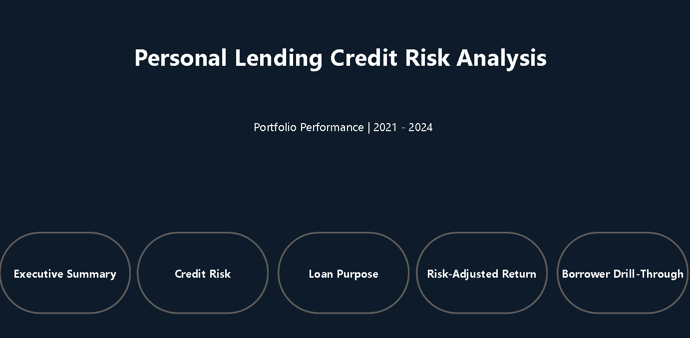
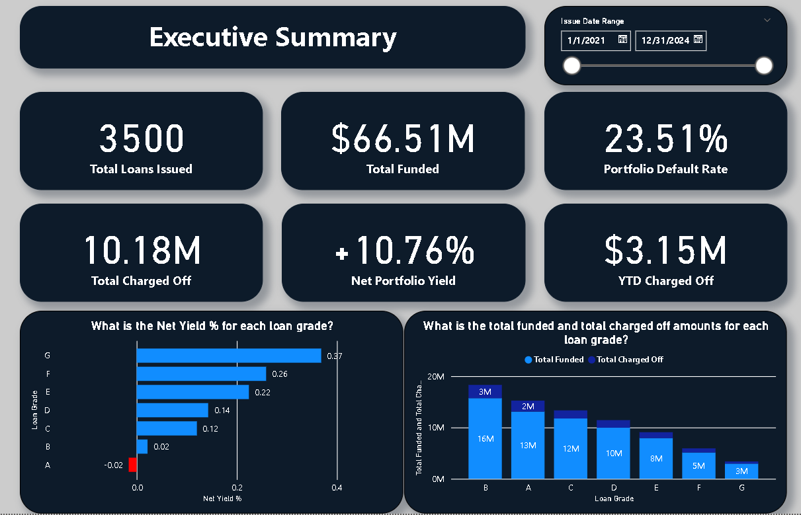
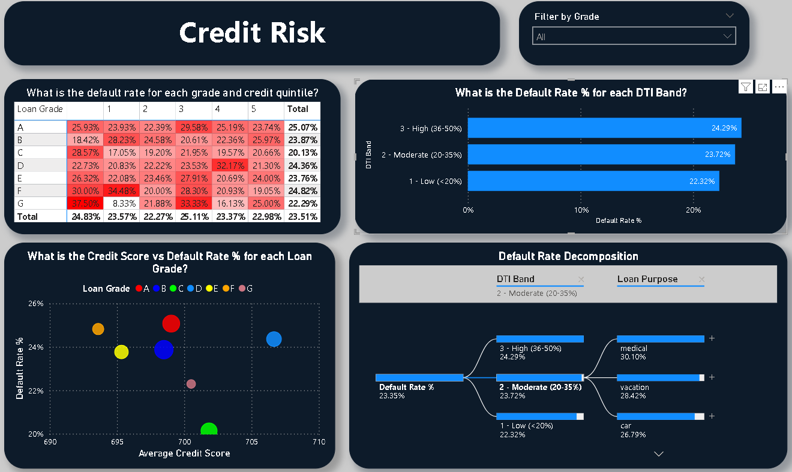
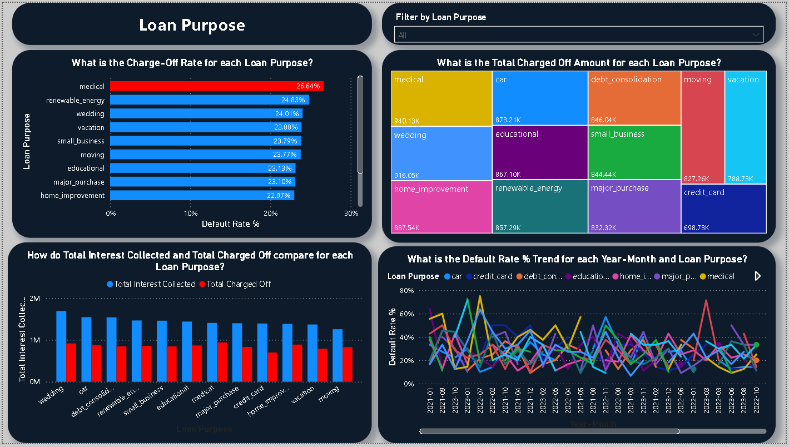
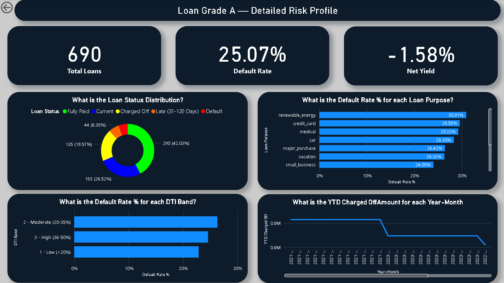

# Finance Credit Risk Analysis
### Personal Lending Portfolio — Default Risk & Net Yield Assessment | 2021–2023

---

## Project Overview

This project investigates a personal lending portfolio to answer one central business question:

> **Which borrowers are most likely to default — and are the loans being issued to high-risk segments priced and structured in a way that justifies the risk exposure?**

Using a synthetic dataset of 3,500 loan records spanning 2021–2023, this analysis moves beyond surface-level default counts to build a composite risk scoring model that evaluates each loan grade on both its default rate and its net yield after charge-off losses. The headline finding challenges a foundational assumption in credit risk: **Grade A — the portfolio's "safest" grade — is the only grade with a negative net yield (-1.58%), meaning it collected less in interest than it lost to defaults.**

This is the third and final project in a multi-industry analytics portfolio spanning Education, Healthcare, and Finance. It represents the most technically advanced work in the series, introducing a fully normalized star schema data model, SQL-based risk tier classification, DAX What-If parameter scenario modeling, and a Decomposition Tree visual.

### Portfolio Progression

| Project | Industry | Focus | Key Technical Addition |
|---|---|---|---|
| Project 1 | Education | Student performance gap analysis | Baseline SQL, Power BI (4 pages) |
| Project 2 | Healthcare | Claim denial & revenue recovery | Drill-through page, window functions, DAX time intelligence |
| Project 3 | Finance | Personal lending credit risk | Star schema, NTILE/risk scoring, DAX What-If parameter, Decomposition Tree |

---

## Business Problem & Analytical Sub-Questions

**Industry:** Consumer Finance / Personal Lending
**Data Scope:** 3,500 loan records, January 2021 – December 2023
**Tools:** Python (Google Colab) → Excel/Power Query → PostgreSQL (pgAdmin) → Power BI Desktop → GitHub

### Five Analytical Sub-Questions

| # | Question | SQL Technique |
|---|---|---|
| Q1 | Which credit score tiers and loan grades carry the highest default burden? | `NTILE(5)`, dual `RANK()` window functions |
| Q2 | Does DTI ratio meaningfully predict defaults — and does this vary by loan purpose? | `CASE` banding, `AVG() OVER (PARTITION BY loan_purpose)` |
| Q3 | Which loan purposes generate the highest charge-off rates and dollar losses? | `PERCENT_RANK()`, multi-level `GROUP BY`, `CAST(... AS NUMERIC)` |
| Q4 | In which payment month do loans first show failure — and does this differ by term? | `LAG() OVER (PARTITION BY loan_id)`, `PARTITION BY loan_term_months` |
| Q5 | Are high-grade loans generating sufficient interest revenue relative to default losses? | 4-CTE composite net yield model, weighted composite risk score |

---

## Data Dictionary

### `loans_clean` — Central Fact Table (3,500 rows)

| Column | Type | Description |
|---|---|---|
| loan_id | VARCHAR(10) | Unique loan identifier (PK) |
| loan_grade | VARCHAR(1) | Risk grade assigned at origination (A–G) |
| loan_subgrade | VARCHAR(2) | Sub-grade within grade (e.g., A1–A5) |
| loan_purpose | VARCHAR(50) | Borrower-stated purpose for the loan |
| loan_term_months | INTEGER | Loan term: 36 or 60 months |
| loan_amount | NUMERIC | Original funded amount |
| interest_rate | NUMERIC | Annual percentage rate at origination |
| installment | NUMERIC | Monthly payment amount |
| issue_date | DATE | Date loan was originated |
| first_payment_date | DATE | Date first payment was due |
| loan_status | VARCHAR(30) | Current status: Fully Paid, Charged Off, Current, Late, Default |
| total_payment | NUMERIC | Total payments received to date |
| principal_received | NUMERIC | Principal portion of payments received |
| interest_received | NUMERIC | Interest portion of payments received |
| charged_off_amount | NUMERIC | Total amount charged off (0 if not charged off) |
| credit_score | INTEGER | Raw FICO score at origination |
| dti | NUMERIC | Debt-to-income ratio at origination |
| annual_income | NUMERIC | Borrower's self-reported annual income |
| employment_length | VARCHAR(20) | Years of employment at origination |
| home_ownership | VARCHAR(10) | RENT, OWN, MORTGAGE, or OTHER |
| addr_state | CHAR(2) | Borrower's state of residence |
| loan_amount_flag | VARCHAR(10) | Power Query flag: OK or FLAGGED |
| interest_rate_flag | VARCHAR(15) | Power Query flag: OK or NEGATIVE_RATE |
| credit_score_flag | VARCHAR(15) | Power Query flag: OK, NULL, BELOW_MIN, ABOVE_MAX |
| dti_flag | VARCHAR(20) | Power Query flag: OK or DTI_IMPOSSIBLE |
| date_sequence_flag | VARCHAR(25) | Power Query flag: OK or DATE_SEQUENCE_ERROR |
| state_flag | VARCHAR(15) | Power Query flag: OK or INVALID_STATE |
| grade_mismatch_flag | VARCHAR(15) | Power Query flag: OK or GRADE_MISMATCH |

### `payment_events_clean` — Payment History Table (23,628 rows)

| Column | Type | Description |
|---|---|---|
| event_id | VARCHAR(10) | Unique event identifier (PK) |
| loan_id | VARCHAR(10) | Foreign key to loans_clean |
| payment_month | INTEGER | Month number since origination (1 = first payment) |
| payment_date | DATE | Date payment was made or missed |
| amount_paid | NUMERIC | Amount paid for the month |
| payment_status | VARCHAR(10) | ON_TIME, LATE, or MISSED |
| payment_date_flag | VARCHAR(15) | Power Query flag: OK or DATE_ERROR |
| amount_flag | VARCHAR(20) | Power Query flag: OK or INVALID_AMOUNT |

### `loan_grades_lookup` — Loan Grade Dimension (35 rows)

| Column | Type | Description |
|---|---|---|
| loan_grade | VARCHAR(1) | Grade letter A–G |
| loan_subgrade | VARCHAR(2) | Subgrade identifier (PK) |
| grade_description | VARCHAR(50) | Plain-language risk tier label |
| base_interest_rate | NUMERIC | Reference rate for the subgrade |

### `geography_lookup` — Geography Dimension (50 rows)

| Column | Type | Description |
|---|---|---|
| state_code | CHAR(2) | Two-letter state abbreviation (PK) |
| state_name | VARCHAR(50) | Full state name |
| census_region | VARCHAR(20) | Northeast, Midwest, South, West |
| census_division | VARCHAR(30) | Census Bureau sub-regional division |

### `Calendar` — Date Dimension (1,461 rows, built in Power BI DAX)

Covers January 1, 2021 – December 31, 2024. Columns: Date, Year, Month Number, Month Name, Quarter, Year-Month.

---

## Data Quality Findings

All data quality issues were identified in Excel/Power Query and flagged rather than deleted, preserving analytical integrity. The flag columns were carried into PostgreSQL for SQL-layer filtering.

### `loans_clean` — 10 Issues Documented

| Code | Issue | Count | Rate |
|---|---|---|---|
| DQ-1 | Duplicate loan records | 100 | 2.7% |
| DQ-2 | Null loan amounts | 300 | 8.1% |
| DQ-3 | Negative interest rates | 80 | 2.2% |
| DQ-4 | Invalid/null credit scores | 150 | 4.1% |
| DQ-5 | DTI values over 100% | 100 | 2.7% |
| DQ-6 | Date sequence errors | 50 | 1.4% |
| DQ-7 | Mixed-case loan_status values | 120 | 3.2% |
| DQ-8 | Invalid state codes | 40 | 1.1% |
| DQ-9 | Null employment_length values | 200 | 5.4% |
| DQ-10 | Grade/subgrade mismatches | 60 | 1.6% |

### `payment_events_clean` — 3 Issues Documented

| Code | Issue | Count |
|---|---|---|
| PE-DQ-1 | Duplicate payment event rows | 30 |
| PE-DQ-2 | Payment dates before loan issue date | 25 |
| PE-DQ-3 | Zero or negative payment amounts | 20 |

---

## SQL Technical Showcase

All SQL files are located in the `sql/` folder and designed to run sequentially against the `credit_risk` PostgreSQL database.

### File Index

| File | Sub-Question | Key Techniques |
|---|---|---|
| `00_setup.sql` | Table creation & import | `CREATE TABLE`, pgAdmin Import/Export |
| `01_default_rate_by_credit_tier.sql` | Q1 | `NTILE(5)`, dual `RANK()` |
| `02_dti_as_default_predictor.sql` | Q2 | `CASE` banding, `AVG() OVER (PARTITION BY)` |
| `03_loan_purpose_chargeoff.sql` | Q3 | `PERCENT_RANK()`, `CAST(... AS NUMERIC)` |
| `04_early_delinquency_signal.sql` | Q4 | `LAG()`, `PARTITION BY loan_term_months` |
| `05_risk_adjusted_return.sql` | Q5 | 4-CTE pipeline, composite risk score |

---

### Key Query: `01_default_rate_by_credit_tier.sql`

**Why NTILE() instead of fixed score bands?**

`NTILE(5)` divides borrowers into five equally-sized quintiles based on the actual distribution of credit scores in the portfolio. This is more analytically sound than fixed cutoffs (e.g., 580–620, 621–660) because it adapts to the portfolio's real score concentration rather than imposing arbitrary boundaries.

Two `RANK()` window functions were applied independently — one on `default_rate_pct` and one on `total_charged_off` — to surface the dual-dimension finding: a grade can rank highest on default *rate* while ranking low on dollar *exposure* due to low loan volume. Grade G ranks #1 on rate but #31 on dollars, while Grade A ranks #3 on rate but #6 on dollars.

```sql
RANK() OVER (ORDER BY default_rate_pct DESC)    AS default_rate_rank,
RANK() OVER (ORDER BY total_charged_off DESC)   AS charged_off_dollar_rank
```

---

### Key Query: `05_risk_adjusted_return.sql`

**Why a 4-CTE pipeline?**

Each CTE builds on the previous to create a clean separation of concerns — a pattern that makes complex analytical logic readable and maintainable:

- **CTE 1 (`valid_loans`):** Filters to analytically valid records using flag columns from Power Query
- **CTE 2 (`grade_financials`):** Aggregates raw financial metrics by loan grade
- **CTE 3 (`net_yield_calc`):** Derives the net yield metric: `(interest_collected - charged_off) / total_funded`
- **Final SELECT:** Applies the composite risk score formula and `CASE`-based tier labeling

**The composite risk score formula:**

```sql
(default_rate_pct * 0.6) + (GREATEST(0, -net_yield_pct) * 0.4)
```

Default rate is weighted 60% as the primary driver. The net yield penalty (40%) uses `GREATEST(0, ...)` to prevent a negative yield from *reducing* the risk score — a grade losing money should add risk, not subtract it.

---

### Key Query: `04_early_delinquency_signal.sql`

**Why LAG()?**

`LAG()` retrieves the previous row's value within a partition — in this case, the prior month's payment status for each loan. This allows detection of the *first* missed payment: the moment a loan transitions from ON_TIME to MISSED, rather than simply counting all missed payments.

```sql
LAG(payment_status) OVER (
    PARTITION BY loan_id
    ORDER BY payment_month
) AS prev_payment_status
```

`PARTITION BY loan_term_months` was added to the aggregation layer to compare 36-month and 60-month delinquency timelines independently.

**Known limitation:** The `pct_that_charged_off` column shows 100% for all rows due to a synthetic data construction artifact. The MISSED payment status was only assigned to the final payment of loans already labeled Charged Off or Default. In production data, this metric would show meaningful variance by payment month and serve as a genuine predictive signal.

---

## Power BI Dashboard

**File:** `Finance_Analysis.pbix`
**Pages:** 6
**DAX Measures:** 17 (stored in `_Measures` table)

### Data Model — Star Schema

```
loans_clean (fact)
    ├── loan_grades_lookup  [loan_subgrade → loan_subgrade]  Many-to-One
    ├── geography_lookup    [addr_state → state_code]        Many-to-One
    ├── payment_events_clean [loan_id ← loan_id]             One-to-Many
    └── Calendar            [issue_date ← Date]              One-to-Many
```

This star schema represents a deliberate evolution from Projects 1 and 2, which used lookup tables without a formal relational model. The `loan_subgrade` join (rather than `loan_grade`) was required because `loan_grade` contains duplicate values across subgrades — a real-world data modeling constraint documented in the troubleshooting log.

---

### Dashboard Pages

**Page 1 — Title & Navigation**
Dark navy landing page with five navigation buttons linking to all analytical pages.



**Page 2 — Executive Summary**
Eight KPI cards covering total loans, total funded ($66.51M), portfolio default rate (23.51%), total charged off ($10.18M), net portfolio yield (+10.76%), YTD charged off, YTD interest collected, and YTD net yield. Includes a Net Yield % by grade bar chart where Grade A appears in red as the only negative bar, and a funded vs charged off clustered column chart. Date range slicer filters all visuals by loan issue date.



**Page 3 — Credit Risk Analysis**
Matrix heat map showing default rate by loan grade and credit quintile with red conditional formatting. Bar chart of default rate by DTI band. Scatter chart of average credit score vs default rate by grade. Decomposition Tree allowing interactive drill-down through grade → DTI band → purpose to isolate highest-risk segments. Grade slicer for filtering.



> *Note: Key Influencers visual was replaced with a Decomposition Tree after determining that the synthetic portfolio's uniform default rate distribution (20–35% across all grades) did not produce statistically significant influencers. The Decomposition Tree provides equivalent analytical value with greater interactivity.*

**Page 4 — Loan Purpose & Charge-Off**
Horizontal bar chart ranking loan purposes by charge-off rate (medical: 27.55% highest). Treemap showing total charged-off dollars by purpose. Clustered column chart comparing interest collected vs charged off by purpose. Monthly default rate trend line chart filtered by loan purpose slicer.



**Page 5 — Risk-Adjusted Return**
The signature page of Project 3. Features a What-If parameter slider (0–35, increment 0.5) that dynamically updates two KPI cards (Grades Above Threshold, Loans Above Threshold) and a constant line on the composite risk score bar chart. Scatter chart plots net yield % vs default rate % by grade — Grade A appears to the left of the zero-yield reference line, confirming its negative return. Summary table displays all seven grades with default rate, net yield (Grade A in red), composite risk score, and risk tier label.


**Page 6 — Borrower Drill-Through**
Accessible by right-clicking any loan grade value on Pages 3, 4, or 5. Dynamic title card updates to reflect the drilled grade (e.g., "Loan Grade A — Detailed Risk Profile"). Displays three filtered KPI cards, loan status donut chart, default rate by purpose bar chart, default rate by DTI band bar chart, and YTD charged off trend line — all scoped to the selected grade.



---

### Key DAX Measures

**Net Yield %**
Calculates portfolio return after charge-off losses as a percentage of total funded amount. Negative values indicate that losses exceeded interest income for the filtered segment.
```dax
Net Yield % =
IF(
    [Total Funded] = 0,
    BLANK(),
    DIVIDE([Total Interest Collected] - [Total Charged Off], [Total Funded])
)
```

**Composite Risk Score**
Weighted combination of default rate (60%) and net yield penalty (40%). `MAX(0, -NetYield)` prevents a negative yield from reducing risk score — a deliberate design decision to ensure money-losing grades are penalized, not rewarded.
```dax
Composite Risk Score =
VAR DefaultRate  = [Default Rate % (Chart)] * 100
VAR NetYield     = [Net Yield %] * 100
VAR YieldPenalty = MAX(0, -NetYield)
RETURN
ROUND((DefaultRate * 0.6) + (YieldPenalty * 0.4), 2)
```

**Loans Above Threshold**
Dynamically filters total loans to only those belonging to grades whose composite risk score exceeds the What-If parameter slider value. Returns 0 (not BLANK) when no grades qualify, using `VAR/RETURN IF(ISBLANK())` to ensure clean KPI card display.
```dax
Loans Above Threshold =
VAR Result =
    CALCULATE(
        [Total Loans],
        FILTER(
            VALUES(loans_clean[loan_grade]),
            [Composite Risk Score] > 'Risk Threshold'[Risk Threshold Value]
        )
    )
RETURN IF(ISBLANK(Result), 0, Result)
```

---

### DAX Pitfalls & Lessons Learned

| Pitfall | Resolution |
|---|---|
| `PERCENTRANK.INC` is an Excel function, not DAX | Replaced with `PERCENTILEX.INC` for calculated columns |
| Calculated columns must be created as New Column, not New Measure | Column formulas referencing `table[column]` without aggregation always fail in measure context |
| `FORMAT()` converts numeric measures to text | Created separate `(Display)` and `(Chart)` versions for all percentage measures |
| `DATESYTD` returned BLANK with historical synthetic data | Replaced with `FILTER(ALL('Calendar'), YEAR('Calendar'[Date]) = LatestYear)` anchored to the latest year in the data |
| BLANK() vs 0 on KPI cards | Wrapped threshold measures in `VAR/RETURN IF(ISBLANK(...), 0, result)` |
| `loan_grade` not unique in `loan_grades_lookup` | Used `loan_subgrade` as the join key — subgrade is the unique column (35 rows, one per A1–G5) |
| Calendar[Year] loaded as Text | Used `YEAR('Calendar'[Date])` in DAX instead of referencing the column directly |

---

## Insight Report

### Finding 1 — Grade A Is Underwater
Grade A loans — the portfolio's lowest-risk tier — carry a net yield of **-1.58%**, the only grade with a negative return. Interest collected ($1.71M) was outpaced by charge-off losses ($1.81M). With a 6.51% average interest rate, Grade A lacks sufficient margin to absorb a 25% default rate.

**Recommendation:** Review Grade A pricing thresholds. An interest rate increase of 150–200 basis points would restore positive net yield without meaningfully reducing approval volume at this credit tier.

---

### Finding 2 — Grade G Is the Most Profitable Grade
Counterintuitively, Grade G — the riskiest grade — delivers the highest net yield at **+33.97%** and ranks #1 on portfolio profitability. High rates (33.92% average) more than compensate for charge-off losses ($342,350 across 132 loans). This finding challenges the assumption that riskier grades are less profitable.

**Recommendation:** Evaluate whether Grade G loan volume can be selectively expanded for borrowers with strong employment history and stable income, where the rate premium is justified by genuine risk rather than grade label alone.

---

### Finding 3 — Medical Loans Lead on Rate; Wedding Leads on Dollars
Medical loans carry the highest charge-off rate at **27.55%** (PERCENT_RANK = 1.0) but wedding loans carry the highest total dollar loss at **$855,491** despite ranking 2nd on rate. This dual-lens finding — rate vs. dollar exposure — demonstrates that a single ranking metric is insufficient for purpose-level risk management.

**Recommendation:** Apply separate oversight policies for medical (rate control) and wedding (volume control). Home improvement loans carry the highest average loss-given-default at $13,769 per failed loan, warranting collateral requirements or lower approval caps.

---

### Finding 4 — DTI Predicts Risk Differently by Loan Purpose
Educational loans at Very High DTI (>50%) default at **57.14%** — the highest rate in the portfolio. However, debt consolidation borrowers at High DTI (36–50%) default *less* than those at Low DTI (<20%), suggesting intentionality of repayment matters as much as debt capacity. A borrower consolidating debt at high DTI is demonstrating financial self-awareness; a low-DTI vacation borrower may not be.

**Recommendation:** Implement purpose-specific DTI thresholds rather than a single portfolio-wide cutoff. Educational loan approvals above 40% DTI should trigger manual underwriting review.

---

### Finding 5 — Month 6 Is the Peak First-Miss Window for 36-Month Loans
For 36-month loans, payment month 6 produced the highest number of first missed payments (10 loans), with 120 total first misses occurring in the first 18 months — the first half of the loan term. This suggests the majority of default risk in short-term loans surfaces early and is identifiable before the midpoint.

**Recommendation:** Design a proactive outreach program targeting 36-month loans approaching month 5. Early intervention at this stage — before the first miss rather than after — could meaningfully reduce charge-off rates. Note: `pct_that_charged_off = 100%` in this query reflects a synthetic data construction artifact and would show meaningful variance in production data.

---

## Skills Matrix

### Technical Tools

| Tool | Application |
|---|---|
| Python (Google Colab) | Synthetic data generation using Faker library; deliberate injection of 10 data quality issue types |
| Excel / Power Query | 10-step cleaning pipeline; flag columns; Merge Queries; Applied Steps naming (per Eli Douglas's recommendation) |
| PostgreSQL (pgAdmin) | 5 analytical queries; table creation; CSV import via pgAdmin Import/Export tool |
| Power BI Desktop | 6-page interactive dashboard; star schema data model; DAX measures; What-If parameter |
| GitHub | Version control; branch-based project organization; recruiter-ready documentation |

### Technical Skills Demonstrated

| Skill | Where Applied |
|---|---|
| Star Schema Data Modeling | Power BI Model view — 1 fact table, 4 dimension tables |
| Window Functions | `NTILE()`, `RANK()`, `LAG()`, `PERCENT_RANK()`, `AVG() OVER (PARTITION BY)` |
| CTE-Based Query Architecture | All 5 SQL files; 4-CTE pipeline in `05_risk_adjusted_return.sql` |
| Composite Metric Design | SQL and DAX composite risk score with documented weighting rationale |
| DAX Time Intelligence | `DATESYTD`, `MAXX`-anchored YTD calculations for historical data |
| DAX What-If Parameters | Interactive risk threshold slider with dynamic KPI cards and constant line |
| Data Quality Documentation | Flag-don't-delete methodology; 10 DQ issues logged with row counts and percentages |
| Drill-Through Navigation | Page 6 dynamically filters to selected loan grade from any page |
| Decomposition Tree | Interactive multi-level drill-down of default rate by grade, DTI, and purpose |
| Synthetic Data Transparency | Known limitations documented openly in README and dashboard tooltips |

---

## Known Limitations & Transparency Notes

- **Synthetic data:** All records were generated using Python's Faker library. Relationships between variables (e.g., grade and default rate) reflect the generation logic rather than real-world lending patterns.
- **Uniform default rate distribution:** Default rates range from 20–35% across all grades and purposes, which is narrower than real-world variance. This caused the Key Influencers visual to find no statistically significant patterns.
- **pct_that_charged_off = 100%:** The MISSED payment status in `payment_events_clean` was only assigned to the final payment of Charged Off/Default loans by construction. In production data, this metric would show meaningful variance by payment month.
- **Loan origination dates:** All loans were originated between January 2021 and December 2023. Selecting 2024 dates in the Issue Date Range slicer returns no results.
- **Calendar[Year] data type:** The Year column loaded as Text in Power BI due to Power Query export behavior. All time intelligence DAX measures use `YEAR('Calendar'[Date])` directly rather than referencing the column.

---

## Repository Structure

```
AllenRattler-Analytics-Portfolio/
└── Finance-Credit-Risk-Analysis/
    ├── data/
    │   ├── raw/
    │   │   ├── loans_raw.csv
    │   │   ├── payment_events_raw.csv
    │   │   ├── loan_grades_lookup.csv
    │   │   └── geography_lookup.csv
    │   └── processed/
    │       ├── loans_clean.csv
    │       └── payment_events_clean.csv
    ├── python/
    │   └── data_generation.ipynb
    ├── sql/
    │   ├── 00_setup.sql
    │   ├── 01_default_rate_by_credit_tier.sql
    │   ├── 02_dti_as_default_predictor.sql
    │   ├── 03_loan_purpose_chargeoff.sql
    │   ├── 04_early_delinquency_signal.sql
    │   └── 05_risk_adjusted_return.sql
    ├── powerbi/
    │   └── Finance_Analysis.pbix
    ├── screenshots/
    │   ├── 01_executive_summary.png
    │   ├── 02_credit_risk.png
    │   ├── 03_loan_purpose.png
    │   ├── 04_risk_adjusted_return.png
    │   ├── 05_borrower_drillthrough.png
    │   └── 06_power_query_applied_steps.png
    └── README.md
```

---

## About the Author

**Allen Rattler** — Data Analyst in Training | Excel · SQL · Power BI

Former 2nd grade elementary school teacher with four years of prior experience in healthcare back-end billing and collections. Building a multi-industry analytics portfolio to demonstrate data analyst capabilities across Education, Healthcare, and Finance.

- GitHub: [AllenRattler-Analytics-Portfolio](https://github.com/allenrattler/AllenRattler-Analytics-Portfolio)
- LinkedIn: Connect to follow the #LearningInPublic journey
